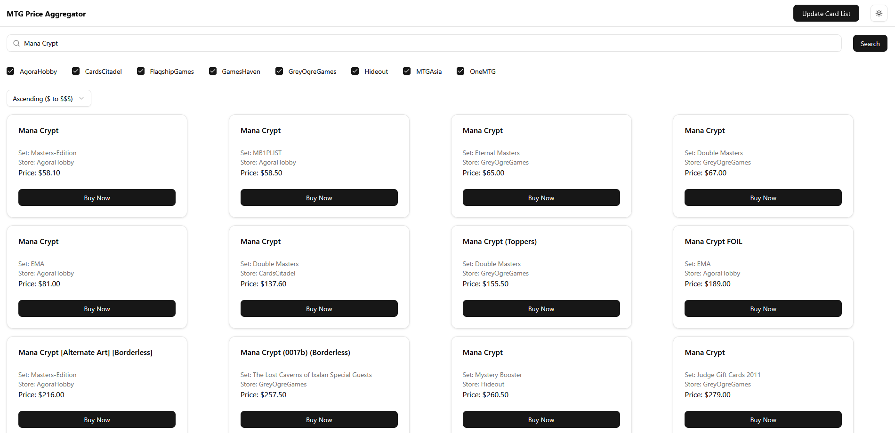

# MTG Price Aggregator
- [MTG Price Aggregator](#mtg-price-aggregator)
  - [Usage](#usage)
    - [Web App](#web-app)
    - [Python Script](#python-script)
    - [Take Note](#take-note)
  - [Installation](#installation)
    - [Web App](#web-app-1)
      - [Docker](#docker)
      - [Manual](#manual)
    - [Script](#script)
  - [Background](#background)
  - [Roadmap](#roadmap)

## Usage

### Web App

Type the MTG card you want to search, select the stores that you want to buy from, and click search. It will give you a list of all of the available cards.

### Python Script

Type the MTG card you want to search, and it will search ALL of the stores. It will give you the price of the cheapest card from each store.

### Take Note

1. You need to type the card's name exactly as it is but it is NOT case-sensitive. This means that for `Chandra's Ignition`, it must include the apostrophe so `Chandras Ignition` will NOT work. `chandra's ignition` and its variants work.
2. For double-sided/room cards, you must include the `//` and the spaces if you're searching for both rooms at the same time. For example, `unholy annex // ritual chamber` works but `unholy annex//ritual chamber` does NOT work. Searching for just `unholy annex` and `ritual chamber` will work fine.

## Installation

### Web App

Tech Stack: BS4, FastAPI, React, Material UI, Docker (optional)

This app was made to be run on your localhost, so change all of the necessary endpoints if running elsewhere.

#### Docker

1. Docker must be installed
2. Clone/Download the repository
3. Install the dependencies; Backend: `cd backend && pip install -r requirements_app.txt`. Frontend: `cd frontend && npm install`
4. Change `localhost` found in `frontend/src/App.jsx` to the host machine's IP, if applicable.
5. Change all instances of `YOUR_IP` found in `docker-compose.yml` to the host machine's IP.
6. At the root directory, run `docker compose build --no-cache && docker compose up -d`
7. Access the frontend at `http://YOUR_IP:10015/`

#### Manual

1. Clone/Download the repository
2. Install the dependencies; Backend: `cd backend && pip install -r requirements_app.txt`. Frontend: `cd frontend && npm install`
3. Change `localhost` found in `frontend/src/App.jsx` to the host machine's IP, if applicable.
4. Start the backend: `uvicorn app:app --reload`
5. Start the frontend: `npm run dev`

### Script

Tech Stack: BS4

1. Python must be installed and added to PATH.
2. Clone/Download the repository OR just `backend/lgs.py`, `backend/script.py`, and `backend/requirements_script.txt`.
3. Install the dependencies by running `pip install -r requirements_script.txt`
4. Run the script

## Background

This is my first actual full-stack web application. I saw that there was no way for me to get the best deals easily, so I created this to help me and it works like a charm.

## Roadmap

- [x] Make the cards in the frontend clickable so that it redirects to the query page (not the specific card). 
- [x] Add the query link to the script output if it doesn't look too ugly.
- [ ] Add a button to export a csv based on the cards chosen. It should contain (card name, store, price, link to query).
- [ ] Find a better way to add the host machine's IP for the web app.
- [ ] Improve the design???
